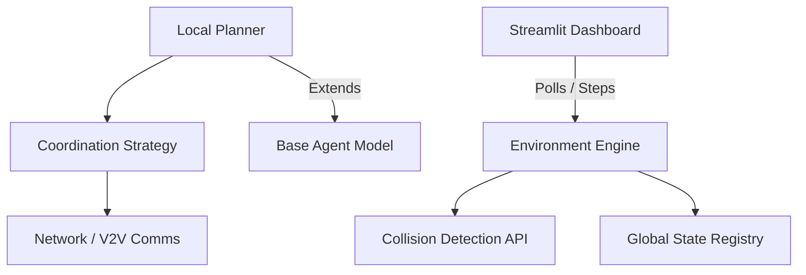

<div align="center">
  
  
  
  

  # 🤖 Multi-Agent Distributed Decision System
  
  **A scalable, responsive, and robust simulation platform for decentralized agent coordination, path planning, and V2V abstract conflict negotiation.**
</div>

---

## 📖 Overview

The **Multi-Agent Decision System** is a sophisticated architectural simulation showcasing how independent autonomous agents navigate shared environments. Relying on continuous environment polling and dynamic state yielding, this engine provides a foundation for scalable **Decentralized Multi-Agent Path Finding (MAPF)**.

This repository features:
- **FAANG-Standard Python Architecture:** Abstract agent classes, structured decoupled state managers, and environment bounds logic.
- **Robust V2V Communication Module:** Agents organically dispatch and receive multi-channel broadcast messaging to negotiate movement priority.
- **Dynamic Streamlit Dashboard:** A vibrant, dark-mode native Python dashboard offering live visual playback mapped with Plotly Graph Objects.
- **Extensive Test Coverage:** Validation pipelines powered by `pytest` mapped out locally to ensure mathematical consistency.

---

## 🏗️ Architecture



## 🚀 Quick Start

Ensure you have Python 3.9+ installed and operational.

1. **Clone the Repository**
   ```bash
   git clone https://github.com/pavitra-d-byali/MultiAgent-RAG-System.git
   cd MultiAgent-RAG-System
   ```

2. **Install Dependencies**
   ```bash
   pip install -r requirements.txt
   ```

3. **Run the Dashboard**
   ```bash
   streamlit run app.py
   ```
   Navigate to `http://localhost:8501` to view the interactive dashboard.

---

## 🧪 Testing

To execute the unit testing validation suite ensuring zero collision regression:
```bash
python -m pytest tests/
```

## 📂 Project Structure

```text
├── app.py                      # Main Streamlit entrance and layout visualization
├── core/                       
│   ├── agent.py                # Base properties of spatial autonomous agents
│   └── environment.py          # Spatial registry and master engine loop
├── communication/              
│   └── network.py              # V2V network messaging logic
├── decision_making/            
│   ├── coordination_strategy.py# Heuristic routing and yielding 
│   └── local_planner.py        # Smart Agent discrete routing
├── tests/
│   └── test_simulation.py      # Unit safety tests
└── requirements.txt            # Dependency graph
```

## 🤝 Contribution & License
Feel free to open issues or PRs targeting the `main` branch. This codebase employs standard python type hinting and requests all PRs to natively pass local `pytest` CI requirements.

<div align="center">
  <i>Maintained with ❤️ for cutting edge open-source autonomy.</i>
</div>
